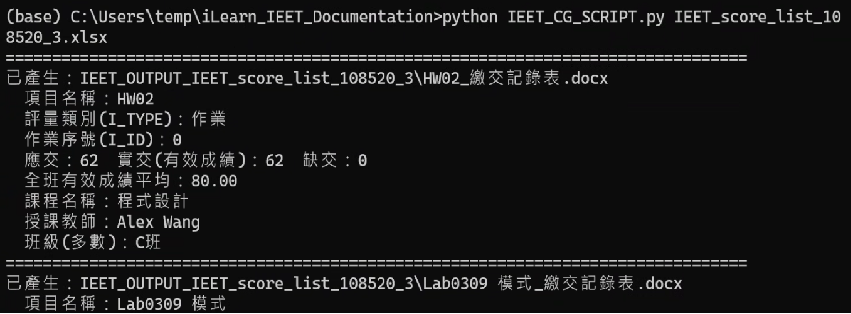
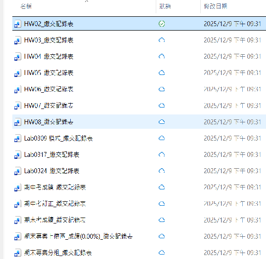
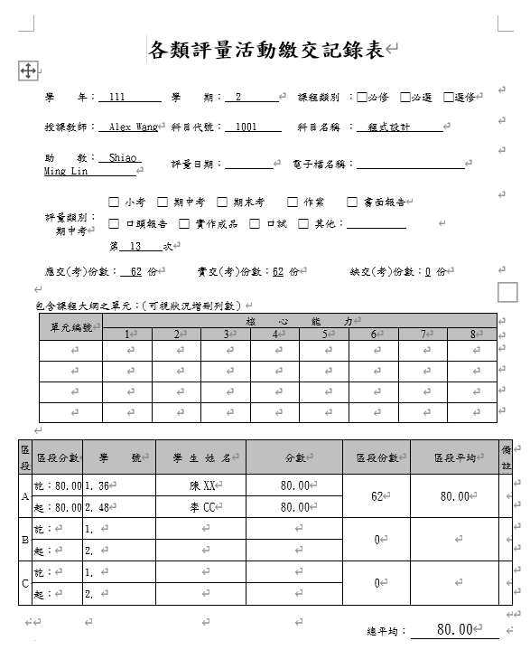

Markdown

# iLearn_IEET_Documentation
Generate IEET documents from iLearn Grade Report

This tool assists users in creating IEET documents directly from their iLearn grade reports.

1. 安裝相關套件 (Python 3.9)
```bash
pip install pandas numpy python-docx openpyxl
```

2. 準備成績檔案

#iLearn匯出成績Excel檔
（這個步驟通常不會有問題）

#Moodle匯出成績Excel檔
（Moodle用複製貼上產生Excel檔）

#注意: 本工具會自動依照**作業項目名稱**分成 **種類**，例如：**期中考**，**期末考**，**期末報告** 等。

#Excel格式參考範例:
IEET_score_list_108520_3.xlsx (注意紅字部分)

3. 執行

```bash
python IEET_CG_SCRIPT.py IEET_score_list_108520_3.xlsx
```

#輸出資料夾: IEET_OUTPUT_IEET_score_list_108520_3/




4. 手動填寫IEET文件其他欄位
(DEMO文件全部成績80分，無法呈現分段)



